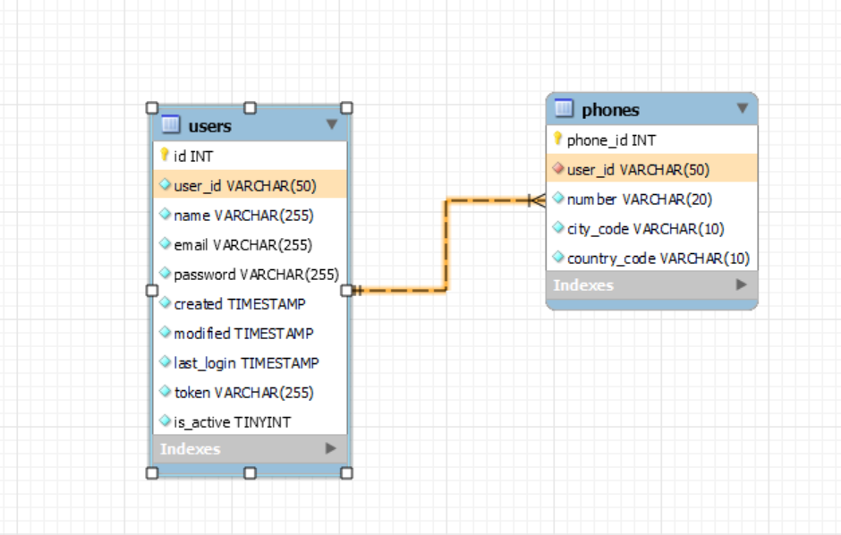
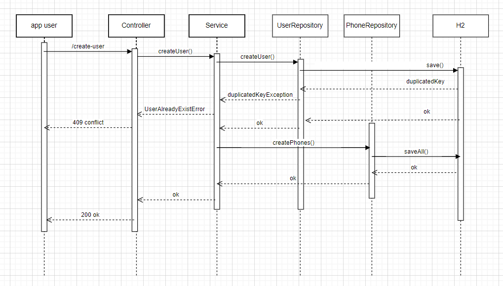
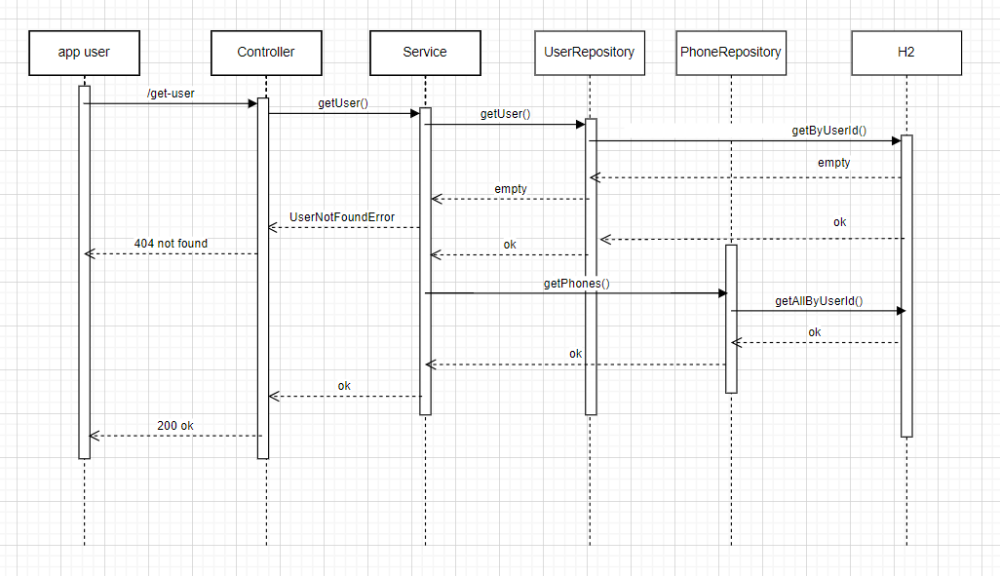
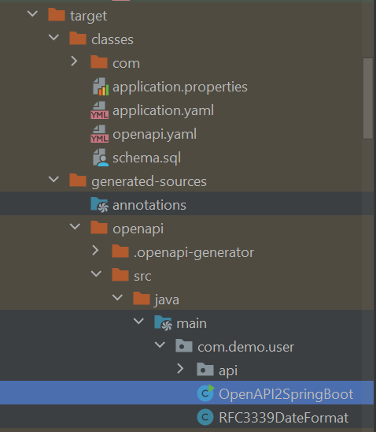

# Create Users
## Intro
This is a demo microservice based on Spring 3.1.6 requested by NISUM to create users.
This microservice use H2 as data bank, r2dbc to handle persistency, reactor reactivity with webflux and
openapi-generator plugin to generate basic classes.

- The sql script used for this project:
```roomsql
-- Create the 'users' table
CREATE TABLE IF NOT EXISTS users (
    id INT NOT NULL AUTO_INCREMENT,
    user_id VARCHAR(50) NOT NULL UNIQUE,
    name VARCHAR(255) NOT NULL,
    email VARCHAR(255) NOT NULL UNIQUE,
    password VARCHAR(255) NOT NULL,
    created TIMESTAMP DEFAULT CURRENT_TIMESTAMP,
    modified TIMESTAMP DEFAULT CURRENT_TIMESTAMP,
    last_login TIMESTAMP DEFAULT CURRENT_TIMESTAMP,
    token VARCHAR(255) NOT NULL,
    is_active BOOLEAN NOT NULL,
    PRIMARY KEY (id)
);

-- Create the 'phones' table
CREATE TABLE IF NOT EXISTS phones (
    phone_id INT PRIMARY KEY AUTO_INCREMENT,
    user_id VARCHAR(50) NOT NULL,
    number VARCHAR(20) NOT NULL,
    city_code VARCHAR(10) NOT NULL,
    country_code VARCHAR(10) NOT NULL,
    CONSTRAINT fk_user_id_users FOREIGN KEY (user_id) REFERENCES users(user_id)
);

```
- The tables diagram:
  


- The solution diagram for endpoint create:



- The solution diagram for endpoint get:



To see the endpoints details please use the [swagger editor](https://editor.swagger.io/) to see the [openapi](src/main/resources/openapi.yaml) file.

## 1. Generate files
This microservice use openapi-generator plugin to generate models and delegate classes, so the first step is to run:
```
mvn clean install
```
To download all dependencies and create autogenerated classes.
To test this feature locally you need the following components:
- "jdk 17"

Then:
- Find the generated main class in Target and run
  


## 2. Test microservice

  You can use the following curl command to create new user:

curl --location --request POST 'http://localhost:9091/v1/user/create-user' \
--header 'security: test' \
--header 'Content-Type: application/json' \
--header 'Cookie: JSESSIONID=99429EAE5E71E9A19575180F04F2CCAA' \
--data-raw '{
"name": "flavio suarez",
"email": "fjosescarmona@gmail.com",
"password": "mypass1234**",
"phones": [
{
"number": "934913223",
"city_code": "1",
"country_code": "51"
},
{
"number": "934913224",
"city_code": "1",
"country_code": "51"
}
]
}'

You can use the following curl command to get a user by id:

curl --location --request GET 'http://localhost:9091/v1/user/get-user?id=$id' \
--header 'security: test' \
--header 'Cookie: JSESSIONID=99429EAE5E71E9A19575180F04F2CCAA'

Use as $id the id returned in the create user endpoint response.